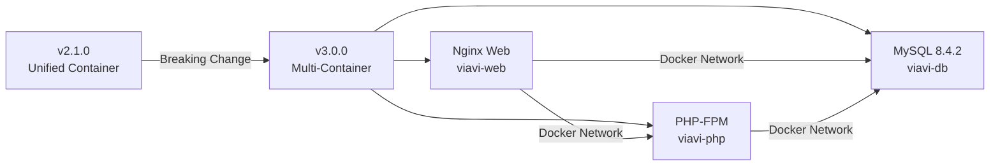

# Changelog

All notable changes to the Viavi 8800SX Database project will be documented in this file.

The format is based on [Keep a Changelog](https://keepachangelog.com/en/1.0.0/),
and this project adheres to [Semantic Versioning](https://semver.org/spec/v2.0.0.html).

## [3.0.6] - 2025-11-09

### Add missing v3.0.0 changelog entry for multi-container architecture transition

### **User description**
CHANGELOG.md jumped from v2.1.0 to v3.0.1, skipping documentation of the v3.0.0 multi-container architecture migration completed in PR #28.

## Changes

- **Added v3.0.0 section** (2025-10-08) between v3.0.1 and v2.1.0 documenting:
  - Multi-container Docker Compose architecture with separate web (Nginx), php-fpm, and db (MySQL 8.4.2) services
  - Docker secrets integration via `secrets/db_password.txt`
  - Traefik reverse proxy labels for production deployments
  - Breaking change from unified to multi-container architecture
  - Migration guide with backup/restore procedures

- **Added version comparison link** for v3.0.0 in changelog footer

The entry accurately reflects the repository's current state: three independent services communicating over a dedicated Docker network, file-based secret management, and optional Traefik integration for production reverse proxy deployments.

<!-- START COPILOT CODING AGENT SUFFIX -->


<details>

<summary>Original prompt</summary>

> Issue #28


</details>


<!-- START COPILOT CODING AGENT TIPS -->
---

✨ Let Copilot coding agent [set things up for you](https://github.com/k9barry/viavi/issues/new?title=✨+Set+up+Copilot+instructions&body=Configure%20instructions%20for%20this%20repository%20as%20documented%20in%20%5BBest%20practices%20for%20Copilot%20coding%20agent%20in%20your%20repository%5D%28https://gh.io/copilot-coding-agent-tips%29%2E%0A%0A%3COnboard%20this%20repo%3E&assignees=copilot) — coding agent works faster and does higher quality work when set up for your repo.


___

### **PR Type**
Documentation


___

### **Description**
- Added comprehensive v3.0.0 changelog entry documenting multi-container architecture transition

- Documented three independent services: Nginx web, PHP-FPM, MySQL database

- Included migration guide with backup/restore procedures for upgrading users

- Added Traefik reverse proxy configuration and Docker secrets integration details


___

### Diagram Walkthrough





<details> <summary><h3> File Walkthrough</h3></summary>

<table><thead><tr><th></th><th align="left">Relevant files</th></tr></thead><tbody><tr><td><strong>Documentation</strong></td><td><table>
<tr>
  <td>
    <details>
      <summary><strong>CHANGELOG.md</strong><dd><code>Add v3.0.0 multi-container architecture changelog entry</code>&nbsp; &nbsp; </dd></summary>
<hr>

CHANGELOG.md

<ul><li>Added v3.0.0 section (2025-10-08) documenting multi-container Docker <br>Compose architecture<br> <li> Detailed three independent services: Nginx, PHP-FPM, and MySQL with <br>specific versions<br> <li> Documented Docker secrets integration, dedicated network, and Traefik <br>reverse proxy labels<br> <li> Included comprehensive migration guide with backup/restore procedures <br>and breaking change notice<br> <li> Added version comparison link in changelog footer for v3.0.0 release</ul>


</details>


  </td>
  <td><a href="https://github.com/k9barry/viavi/pull/58/files#diff-06572a96a58dc510037d5efa622f9bec8519bc1beab13c9f251e97e657a9d4ed">+85/-0</a>&nbsp; &nbsp; </td>

</tr>
</table></td></tr></tr></tbody></table>

</details>

___

## [3.0.5] - 2025-10-14

### Create empty uploads folder with 0777 permissions and track in git

## Summary

This PR creates an empty `uploads/` directory at `/data/web/app/` with 0777 permissions and ensures it's tracked in the git repository.

## Changes

- **Removed** `data/web/app/uploads/` from `.gitignore` to allow the directory to be tracked
- **Created** the `data/web/app/uploads/` directory with 0777 permissions
- **Added** `.gitkeep` file inside the uploads directory (git requires a file to track empty directories)

## Rationale

Previously, the uploads directory was dynamically created at runtime by the application code when files were uploaded. This PR makes the directory part of the repository structure with proper permissions, ensuring:

1. The directory is always present when the application starts
2. Permissions are explicitly set to 0777 for proper file upload handling
3. Docker containers can mount this directory without permission issues
4. The directory structure is clear to developers and operators

## Backward Compatibility

This change is fully backward compatible. The existing code in `main.php` and `helpers.php` checks if the directory exists before attempting to create it:

```php
if (!file_exists($upload_target_dir)) {
    mkdir($upload_target_dir, 0777, true);
}
```

Since the directory now exists in the repository, the application will simply skip the creation step and use the existing directory.

## Testing

Verified that:
- Directory has correct 0777 permissions (`drwxrwxrwx`)
- Directory is tracked by git and included in commits
- PHP can detect and write to the directory
- Existing upload functionality remains compatible

<!-- START COPILOT CODING AGENT SUFFIX -->


<details>

<summary>Original prompt</summary>

> Create an empty uploads folder in this repo at /data/web/app/ and   keep it in the repo as an empty file.  give it 0777 permissions


</details>


<!-- START COPILOT CODING AGENT TIPS -->
---

[3.0.6]: https://github.com/k9barry/viavi/releases/tag/v3.0.6

✨ Let Copilot coding agent [set things up for you](https://github.com/k9barry/viavi/issues/new?title=✨+Set+up+Copilot+instructions&body=Configure%20instructions%20for%20this%20repository%20as%20documented%20in%20%5BBest%20practices%20for%20Copilot%20coding%20agent%20in%20your%20repository%5D%28https://gh.io/copilot-coding-agent-tips%29%2E%0A%0A%3COnboard%20this%20repo%3E&assignees=copilot) — coding agent works faster and does higher quality work when set up for your repo.

## [3.0.4] - 2025-10-13

### Automate CHANGELOG updates with PR title and description for every release

## Overview

This PR updates the semantic versioning workflow to automatically populate the CHANGELOG with PR title and description for every release, eliminating the need for manual [Unreleased] section management.

## Problem

The previous workflow required contributors to manually edit the CHANGELOG.md file by adding changes to an [Unreleased] section. This approach had several issues:
- Manual CHANGELOG editing created merge conflicts
- Inconsistent formatting across entries
- Extra maintenance overhead for contributors
- Risk of forgetting to document changes

## Solution

The workflow now automatically extracts the PR title and description when a PR is merged to main, and uses this information to create properly formatted CHANGELOG entries and GitHub releases.

### Workflow Changes

**Before:**
```markdown
## [Unreleased]
### Added
- Feature manually added by contributor
```
Workflow would move this to a version section on release.

**After:**
The workflow now:
1. Extracts PR title and description using GitHub CLI
2. Creates a new version section directly: `## [X.Y.Z] - YYYY-MM-DD`
3. Uses PR title as the heading: `### <PR Title>`
4. Includes PR description as the content
5. Updates version comparison links automatically

### File Changes

**`.github/workflows/semantic-versioning.yml`**
- Added "Get PR details" step to extract PR information
- Modified CHANGELOG update logic to insert version sections with PR content
- Simplified release creation using echo commands for proper variable expansion
- Removed dependency on [Unreleased] section

**`CHANGELOG.md`**
- Removed `## [Unreleased]` section
- Removed `[Unreleased]` version comparison link
- Updated documentation for contributors: document changes in PR descriptions instead of CHANGELOG
- Updated maintainer documentation to reflect fully automated process

**`.github/copilot-instructions.md`**
- Updated semantic versioning workflow documentation
- Added emphasis on writing clear, descriptive PR titles and descriptions
- Removed references to manual [Unreleased] section management

## Benefits

✅ **Zero manual CHANGELOG maintenance** - Contributors only write PR descriptions  
✅ **No merge conflicts** - CHANGELOG is only modified by automated workflow  
✅ **Consistent formatting** - All entries follow the same structure  
✅ **Better documentation** - PR descriptions are more detailed since they become the changelog  
✅ **Improved code reviews** - Better PR descriptions lead to better review discussions  
✅ **Complete automation** - Every release is properly documented with date and description  

## Usage

Contributors should now write clear, descriptive PR titles and descriptions using these categories:
- **Added** - new features
- **Changed** - changes to existing functionality
- **Deprecated** - soon-to-be removed features
- **Removed** - removed features
- **Fixed** - bug fixes
- **Security** - security fixes

The PR description becomes the changelog entry, so quality matters!

## Testing

- ✅ YAML syntax validated with Python yaml parser
- ✅ Created test script simulating CHANGELOG updates with sample PR data
- ✅ Verified correct version insertion and link generation
- ✅ Code review completed with no issues
- ✅ End-to-end workflow logic verified

## Breaking Change

This is a workflow breaking change:
- No more [Unreleased] section in CHANGELOG.md
- Contributors must adapt to documenting changes in PR descriptions
- Existing changelog entries remain unchanged
- Only future releases use the new format

Closes #[issue-number]

<!-- START COPILOT CODING AGENT SUFFIX -->


<details>

<summary>Original prompt</summary>

> Made it so that every patch, minor or major release causes the CHANGELOG to be updated with the date of the release and the title and description of the PR merge.  make sure the CHANGELOG has a release section for every release version and there is no need for the unreleased section then.


</details>


<!-- START COPILOT CODING AGENT TIPS -->
---

[3.0.6]: https://github.com/k9barry/viavi/releases/tag/v3.0.6

[3.0.5]: https://github.com/k9barry/viavi/releases/tag/v3.0.5

💡 You can make Copilot smarter by setting up custom instructions, customizing its development environment and configuring Model Context Protocol (MCP) servers. Learn more [Copilot coding agent tips](https://gh.io/copilot-coding-agent-tips) in the docs.

## [3.0.2] - 2025-10-13
### Fixed
- Updated CHANGELOG.md to include missing version 3.0.2 section

## [3.0.1] - 2025-10-13
### Added
- New semantic versioning workflow for automated release management
  - Supports version bumping based on PR labels (major, minor, patch)
  - Defaults to patch version bump if no label is specified
  - Automatically creates GitHub releases with version tags

### Changed
- Streamlined CI/CD pipeline by replacing Docker-specific workflows with semantic versioning workflow

### Fixed
- Semantic versioning workflow now automatically updates CHANGELOG.md when releasing new versions
  - Moves items from [Unreleased] section to new version section with date
  - Updates version comparison links at the end of the file
- Semantic versioning workflow now automatically updates README.md version badge
- Fixed trailing spaces in semantic-versioning.yml workflow file

### Removed
- Removed docker-image.yml workflow (replaced by semantic versioning workflow)
- Removed docker-publish.yml workflow (replaced by semantic versioning workflow)

## [3.0.0] - 2025-10-08

### Overview

This major version introduces a multi-container Docker Compose architecture, separating the web server, PHP-FPM, and database into independent services for improved scalability, maintainability, and deployment flexibility.

### Added

- Multi-container Docker Compose architecture with three separate services:
  - **web**: Nginx web server (container: `viavi-web`)
  - **php-fpm**: PHP 8.3.2-FPM application server (container: `viavi-php`)
  - **db**: MySQL 8.4.2 database server (container: `viavi-db`)
- Docker secrets support for secure password management via `secrets/db_password.txt`
- Dedicated Docker network (`viavi`) for inter-service communication
- Traefik reverse proxy labels for production deployments (commented out by default)
  - HTTP to HTTPS redirect configuration
  - Let's Encrypt certificate resolver support
  - Host-based routing for `viavi.example.com`

### Changed

- **Breaking**: Transitioned from unified container to multi-container architecture
- Dockerfile now builds only PHP-FPM container (previously included Nginx + PHP + MySQL)
- Database connection in `config.php` now uses `DB_PASSWORD_FILE` environment variable
- Service dependencies configured with `depends_on` for proper startup order
- Container names standardized: `viavi-web`, `viavi-php`, `viavi-db`
- Network configuration simplified with single bridge network

### Configuration

- Database password now loaded from Docker secrets file
- Environment variable `DB_PASSWORD_FILE` points to secrets location
- Port 8080 exposed for web interface (configurable in docker-compose.yml)
- Volume mounts preserved for persistence:
  - Database data: `./data/db/data`
  - Database logs: `./data/db/logs`
  - Application code: `./data/web`

### Migration Notes

Users upgrading from v2.1.0 or earlier need to:

1. **Backup existing data**:

   ```bash
   docker exec viavi mysqldump -u viavi -p viavi > backup.sql
   ```

2. **Stop old container**:

   ```bash
   docker stop viavi && docker rm viavi
   ```

3. **Ensure password file exists**:

   ```bash
   echo "YourSecurePassword" > secrets/db_password.txt
   ```

4. **Deploy multi-container setup**:

   ```bash
   docker compose up -d
   ```

5. **Restore data if needed** (for fresh database):

   ```bash
   docker exec -i viavi-db mysql -u viavi -p viavi < backup.sql
   ```

### Benefits

- **Scalability**: Individual services can be scaled independently
- **Maintainability**: Easier to update or replace individual components
- **Flexibility**: Services can be deployed on different hosts if needed
- **Security**: Database isolated from web-accessible containers
- **Production-ready**: Built-in Traefik support for reverse proxy deployments

### Backward Compatibility

This is a **breaking change**. The unified container approach from v2.x is no longer supported. Users must migrate to the multi-container architecture.

## [2.1.0] - 2025-10-11

### Added
- Comprehensive security policy with vulnerability reporting process (SECURITY.md)
- Development guidelines for GitHub Copilot and contributors (.github/copilot-instructions.md)
- Centralized security header management (data/web/app/security-headers.php)
- MIME type validation for file uploads to prevent malicious file disguises
- HTML escaping for all user-controlled output
- Database initialization directory structure (data/db/init/)

### Changed
- Complete documentation overhaul with detailed README.md including:
  - Feature descriptions and prerequisites
  - Step-by-step installation and usage guides
  - Configuration options and troubleshooting
  - Architecture overview
- Reorganized application file structure for better maintainability:
  - Consolidated application files in data/web/app/
  - Simplified Docker configuration with single Dockerfile
  - Improved directory organization for database files
- Enhanced security in file upload handler (main.php):
  - Case-insensitive file extension validation
  - MIME type verification using finfo_file()
  - XSS prevention through proper output escaping
- Updated Docker configuration:
  - Fixed PHP-FPM directory creation in build process
  - Corrected database initialization paths
  - Updated .gitignore for better database file management

### Removed
- Legacy connection.php file (merged into config.php)
- Unused result.php file
- TCPDF from version control (now downloaded during build)
- Obsolete config directory structure

### Fixed
- Docker build failures due to missing directory structures
- Incorrect database initialization file paths
- Hardcoded localhost URLs preventing flexible deployment

### Security
- XSS vulnerability in filename display
- File upload security with MIME type validation
- Comprehensive security headers (X-Frame-Options, CSP, X-Content-Type-Options, etc.)
- Production deployment security checklist and best practices

## [1.0.0] - 2024-10-01

### Added
- Initial Docker Compose setup for Viavi 8800SX service monitor
- PHP 8.3.2-FPM web application
- MySQL database with PHPMyAdmin integration
- File upload system for .txt service monitor output files
- Automated parsing and database storage of test records
- CRUD operations for alignment records
- Multi-language support (12 languages)
- Bootstrap 4.5.0 responsive UI
- Search and filter functionality
- BLOB storage for complete service records

## How to Use This Changelog

### For Contributors
Document your changes in the Pull Request description. Use these categories for clarity:
- **Added** - new features
- **Changed** - changes to existing functionality
- **Deprecated** - soon-to-be removed features
- **Removed** - removed features
- **Fixed** - bug fixes
- **Security** - security fixes

### For Maintainers
When a PR is merged to main, the semantic versioning workflow automatically:
1. Creates a new version section with: `## [X.Y.Z] - YYYY-MM-DD`
2. Adds the PR title and description as the release notes
3. Updates version comparison links
4. Updates the README.md version badge
5. Creates a GitHub release with the same information

**Note**: Ensure you add the appropriate PR label (major, minor, or patch) to control the version bump. The PR title and description become the changelog entry, so write them clearly and descriptively.

### Version Format
- **MAJOR** (X.0.0) - Incompatible API changes
- **MINOR** (0.X.0) - Backwards-compatible new functionality
- **PATCH** (0.0.X) - Backwards-compatible bug fixes

---

[3.0.6]: https://github.com/k9barry/viavi/releases/tag/v3.0.6

[3.0.5]: https://github.com/k9barry/viavi/releases/tag/v3.0.5

[3.0.4]: https://github.com/k9barry/viavi/releases/tag/v3.0.4

[3.0.3]: https://github.com/k9barry/viavi/releases/tag/v3.0.3
[3.0.2]: https://github.com/k9barry/viavi/releases/tag/v3.0.2
[3.0.1]: https://github.com/k9barry/viavi/releases/tag/v3.0.1
[3.0.0]: https://github.com/k9barry/viavi/releases/tag/v3.0.0
[2.1.0]: https://github.com/k9barry/viavi/releases/tag/v2.1.0
[1.0.0]: https://github.com/k9barry/viavi/releases/tag/v1.0.0
